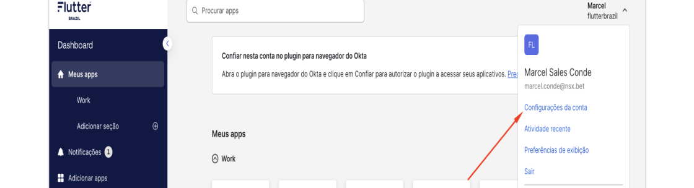
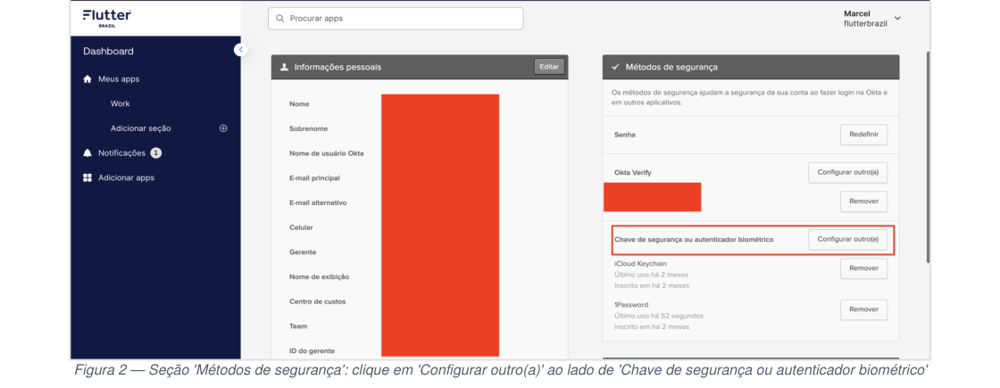

# POP — Vinculação de YubiKey ao Okta

## Objetivo

Este Procedimento Operacional Padrão (POP) descreve o processo para vincular uma YubiKey como segundo fator de autenticação (MFA) na plataforma Okta, garantindo acesso seguro aos sistemas corporativos da Flutter Brazil.

> **O que é uma YubiKey?**
> Uma YubiKey é um pequeno dispositivo físico (semelhante a um pen drive) que funciona como segundo fator de autenticação. Ao fazer login nos sistemas da empresa, além da senha, o usuário toca na YubiKey para confirmar sua identidade — impedindo acessos não autorizados mesmo que a senha seja comprometida.

---

## Pré-requisitos

- Ter a YubiKey fisicamente em mãos.
- Usar um computador (não um celular).
- Navegador: **Google Chrome** ou **Microsoft Edge** (recomendado).
- Verificar se a porta USB do computador está funcionando.
- Se o computador possuir somente porta USB-C e a YubiKey for USB-A, providenciar um adaptador antes de iniciar.
- Ter credenciais corporativas (e-mail e senha) do Okta.

---

## Procedimento

### 1. Acessar o Painel do Okta

1. Abrir o **Google Chrome** ou o **Microsoft Edge**.
2. Acessar o portal Okta da empresa (o mesmo endereço utilizado no dia a dia).
3. Fazer login com e-mail e senha corporativos.

---

### 2. Abrir as Configurações da Conta

1. No canto superior direito, clicar no seu **nome de usuário** (ex.: `Marcel flutterbrazil`).
2. Um menu suspenso será exibido. Caso não apareça, clicar diretamente na seta ao lado do nome.
3. Selecionar **"Configurações da conta"**.

---

### 3. Reautenticar para Acessar as Configurações de Segurança

> **Importante:** O Okta exige confirmação de identidade antes de permitir alterações nos métodos de segurança. Esta etapa pode variar conforme a política da organização.

1. Caso solicitado, inserir a senha corporativa novamente e/ou tocar na YubiKey já registrada (se houver).
2. Confirmar a autenticação para prosseguir.

---

### 4. Localizar a Seção "Métodos de Segurança"

1. Após abrir as configurações, rolar a página para baixo.
2. Identificar os dois blocos exibidos: **Informações pessoais** (esquerda) e **Métodos de segurança** (direita).
3. Dentro de "Métodos de segurança", localizar o item **"Chave de segurança ou autenticador biométrico"**.

---

### 5. Iniciar o Cadastro da YubiKey

1. Ao lado de **"Chave de segurança ou autenticador biométrico"**, clicar em:
   - **"Configurar"** — se nenhuma chave física estiver cadastrada ainda.
   - **"Configurar outro(a)"** — se já existir uma chave cadastrada e desejar adicionar outra.
2. Cada colaborador deve ter **somente a YubiKey** cadastrada como chave de segurança física.

---

### 6. Seguir o Assistente de Configuração do Okta

1. Uma janela/pop-up será exibida com as instruções do Okta.
2. Clicar em **"Configurar"** ou **"Adicionar chave de segurança"**.
3. O navegador solicitará permissão para detectar o dispositivo — clicar em **"Permitir"** ou **"OK"**.
4. Caso o navegador apresente a opção de escolha entre **"Chave de segurança"** e **"Esta chave de acesso"** (passkey), selecionar **"Chave de segurança"**. Não selecionar passkey.

---

### 7. Conectar a YubiKey ao Computador

1. Pegar a YubiKey e inserí-la em uma **porta USB** do computador.
2. Aguardar o sistema reconhecer o dispositivo (normalmente de **2 a 5 segundos**).
3. O sistema operacional pode exibir uma notificação confirmando a detecção do dispositivo — isso é esperado.

---

### 8. Tocar na YubiKey Quando Solicitado

1. O navegador exibirá uma mensagem solicitando que o usuário **toque na chave de segurança**.
2. Localizar o pequeno **círculo dourado ou sensor** na YubiKey.
3. Tocar com o dedo nesse sensor por **1 a 2 segundos** (como uma leitura de digital).
4. A YubiKey piscará ou emitirá um sinal luminoso confirmando o toque.

> **Dica:** Se a tela travar na etapa de toque, aguardar a animação do navegador indicar que está aguardando e tocar novamente. Toques muito rápidos podem não ser registrados.

---

### 9. Nomear a Chave (Recomendado)

1. O Okta solicitará que o dispositivo seja nomeado.
2. Escolher um nome identificável, por exemplo:
   - `YubiKey escritório`
   - `YubiKey pessoal`
   - `YubiKey - [nome do colaborador]`
3. Clicar em **"Salvar"** ou **"Concluir"**.

---

### 10. Confirmar o Cadastro

1. Após salvar, o usuário será redirecionado de volta à seção **"Métodos de segurança"**.
2. A YubiKey aparecerá na lista com:
   - O nome escolhido.
   - A data de cadastro.
   - O botão **"Remover"**.
3. O cadastro está concluído.

---

### 11. Testar o Login com a YubiKey (Recomendado)

> **Importante:** Realizar o teste ainda com a sessão ativa, para garantir que o vínculo funcionou antes de encerrar a sessão atual.

1. Abrir uma aba anônima/privada do navegador.
2. Acessar novamente o portal Okta.
3. Realizar o login com e-mail e senha corporativos.
4. Quando o Okta solicitar o segundo fator, inserir a YubiKey na porta USB e tocar no sensor dourado.
5. Confirmar que o login foi concluído com sucesso.

---

## Como Usar a YubiKey no Login do Dia a Dia

| Passo | Ação |
|---|---|
| 1 | Inserir a YubiKey na porta USB do computador |
| 2 | Acessar o portal Okta e fazer login com e-mail e senha |
| 3 | Quando solicitado o segundo fator, tocar no sensor dourado da YubiKey |
| 4 | Login concluído — nenhum software adicional é necessário |

---

## Problemas Comuns e Como Resolver

| Problema | Possível Causa | O Que Fazer |
|---|---|---|
| Navegador não detecta a YubiKey | USB não reconhecida ou navegador desatualizado | Remover e reinserir; tentar outra porta USB; atualizar o navegador |
| Tela trava em "toque na chave" | Sensor não foi tocado ou o toque foi muito rápido | Tocar novamente, mantendo o dedo por 2 segundos |
| Erro "dispositivo não suportado" | Navegador incompatível (ex.: Safari, Firefox sem extensão) | Usar Chrome ou Edge |
| Navegador pergunta sobre "passkey" ao invés de chave de segurança | Fluxo de passkey ativado no navegador | Selecionar a opção "Chave de segurança" quando apresentada |
| YubiKey perdida ou extraviada | Chave física extraviada | Acionar o suporte de TI imediatamente pelo Slack **#team-techinfra** para remover o vínculo |
| Quero vincular uma segunda YubiKey | Backup ou troca de dispositivo | Repetir este processo a partir do **Passo 5** — múltiplas chaves são permitidas |
| Solicitação de reautenticação ao abrir as configurações | Política de segurança do Okta | Inserir a senha corporativa quando solicitado e continuar o processo |

> Em caso de dúvidas ou problemas, acionar o time de suporte de TI pelo canal do Slack **#team-techinfra**.

---

## Validação

- A YubiKey deve aparecer na seção "Métodos de segurança" com nome, data de cadastro e opção de remoção.
- O login com YubiKey como segundo fator deve ser concluído com sucesso (conforme **Passo 11**).
- O colaborador deve conseguir acessar os sistemas corporativos normalmente após o vínculo.

---

## Boas Práticas

- Manter a YubiKey sempre consigo durante o expediente.
- Registrar uma segunda YubiKey como backup, quando disponível.
- Nunca compartilhar a YubiKey com outros colaboradores.
- Em caso de perda, acionar o suporte de TI imediatamente para remoção do vínculo.
- Testar o login após cada novo vínculo, antes de encerrar a sessão ativa.

---

## Responsabilidades

| Responsável | Atividade |
|---|---|
| Colaborador | Realizar o vínculo da YubiKey conforme este POP e testar o acesso |
| TI / Suporte (Infra) | Fornecer a YubiKey, orientar o processo e remover vínculos em caso de perda |
| Gestor do Time | Garantir que todos os colaboradores do time realizem o vínculo |
| Segurança / Compliance | Auditar periodicamente os dispositivos cadastrados no Okta |

---

## Registro de Mudanças

| Versão | Data | Descrição |
|---|---|---|
| 1.0 | 2026-05-15 | Criação do POP para vinculação de YubiKey ao Okta — Flutter Brazil |

---

## Notas

- As imagens referenciadas neste documento (`./assets/yubikey-okta/`) devem ser extraídas do documento original `vinculo-yubikey-okta.pdf` e salvas na pasta correspondente.
- Este documento é de uso interno exclusivo da Flutter Brazil.
- Organização: Flutter Brazil | Plataforma: Okta
